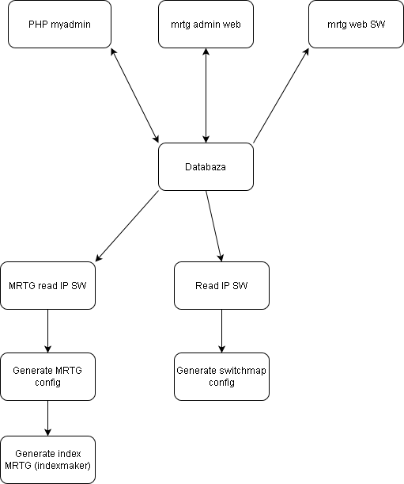

MRTG,switchmap php admin




Install package debian/ubuntu:

```sh
apt install mrtg apache2 php php-mysql mariadb-server mariadb-client composser
```


Install script for generate MRTG configuration from MySQL database:
```sh
mkdir /var/www/mrtg
cp script /
```

Script contain:

1. generujV2-cron.sh – Create MRTG configuration (/etc/mrtg.cfg)

2. mysql.sh – Select all switch IP address from MYSQL


Web admin install:
Copy data from git to web root directrory. 

```sh
cd /var/www/
git clone https://github.com/matoH12/MRTG-admin-DASHBOARD.git .
mysql -u root mrtgadmin < admin/mrtgadmin.sql
```


Setting password for MYSQL in file:
1. index.php

```sh
function lokalita($id_budova)
{
$mysqli = new mysqli("localhost", "admin", 'yabFidth3', "mrtgadmin");
...
```

2. admin/config/config.php

```sh
|--------------------------------------------------------------------------
| DATABASE CONFIGURATION
|--------------------------------------------------------------------------
 */

define('DB_HOST', "localhost");
define('DB_USER', "admin");
define('DB_PASSWORD', "yadFidth");
define('DB_NAME', "mrtgadmin");

```

Default credential for local account:
```sh
User: admin
Password: admin
```


For authenticate you can use keaycloak sso system over openid protocol. Configure credential in:

authenticate.php

```sh
$provider = new Stevenmaguire\OAuth2\Client\Provider\Keycloak([
    'authServerUrl'         => 'https://sso.local.sk/auth',
    'realm'                 => 'realm1',
    'clientId'              => 'mrtg.local.sk',
    'clientSecret'          => '39d50b9d-22a4-49af-9049-587547247391',
    'redirectUri'           => 'https://mrtg.local.sk/admin/authenticate.php',
//    'encryptionAlgorithm'   => 'RS256',                             // optional
//    'encryptionKeyPath'     => '../key.pem'                         // optional
//    'encryptionKey'         => 'contents_of_key_or_certificate'     // optional
]);

```

This project use for authenticate this dictiornary:

https://github.com/stevenmaguire/oauth2-keycloak


Cron settings:
```sh
1 1 * * * /script/mysql.sh
2 1 * * * /script/generujV2-cron.sh
30 1 * * * php /var/www/html/local.sk/admin/script/scansnmp.php
1 2 * * * php /script/switchmapfrommysql.php
44 * * * * /var/www/html/switchmap.local.sk/ScanSwitch.pl
49 * * * * /var/www/html/switchmap.local.sk/GetArp.pl
01 3 * * * /var/www/html/switchmap.local.sk/SwitchMap.pl
```


